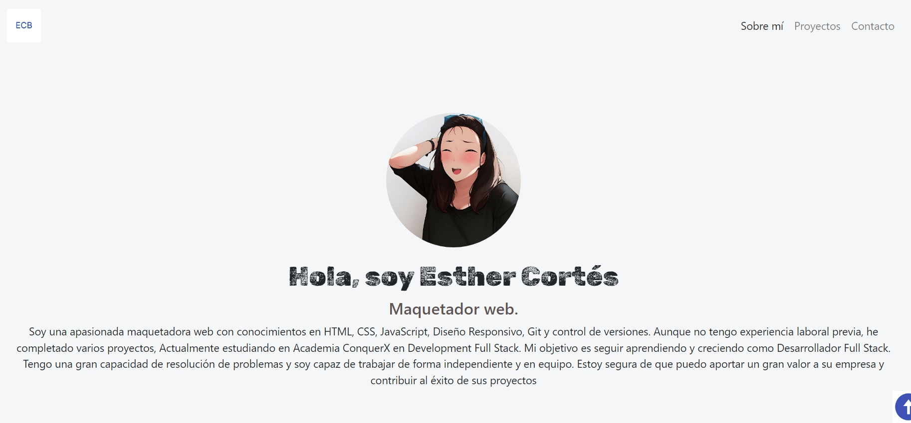
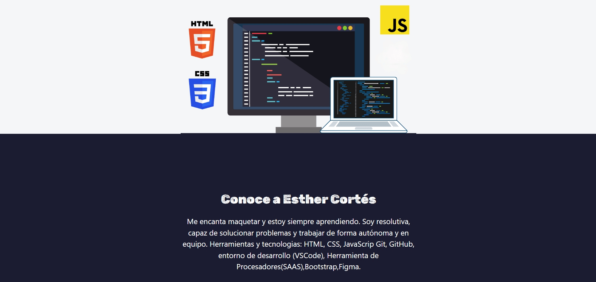
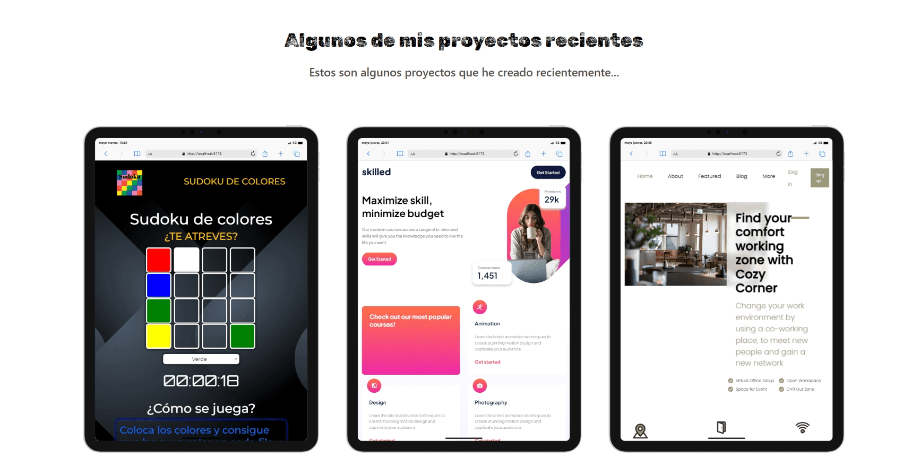
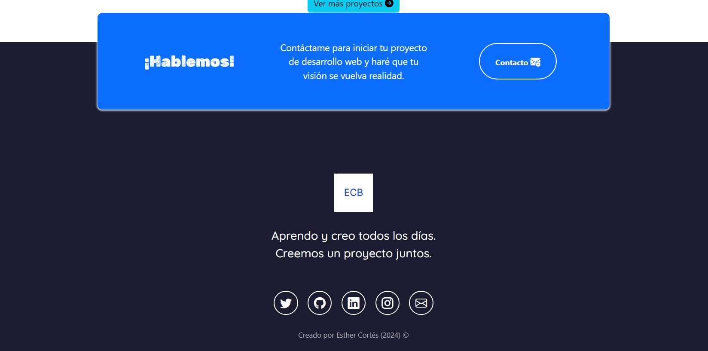

# Portafolio Adaptable (Responsive) con Bootstrap 5

Es una página web adaptable a dispositivos de distintos tamaños "responsive".

El propósito de esta página web es mostrar el portafolio de proyectos de una desarrolladora y su experiencia. Incluye una descripción breve de su motivación, experiencia, proyectos y formas de contacto.

### Capturas de pantalla:

Primera parte de la página web:

Experiencia:

Proyectos:

Contacto:

 
  

## Tecnologías

Esta página web fue creada con:

- HTML
- CSS
- JavaScript
- Bootstrap 5

Además, se incluyeron **Google Fonts** para personalizar la fuente y **Bootstrap icons** para incorporar íconos como flechas y logos de redes sociales populares.

## Contacto

Estoy disponible para trabajar en proyectos de diseño web, ya sea para particulares o empresas. Si necesitas ayuda con el diseño de tu sitio web o tienes algún proyecto en mente, ¡no dudes en contactarme en
 

## Licencia 📜

Este proyecto está bajo la licencia [MIT]
